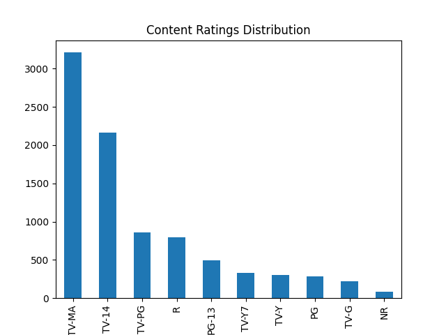

# 📺 Netflix Exploratory Data Analysis (EDA)

## 📌 Project Overview
This project explores the **Netflix Movies and TV Shows dataset** to uncover insights about content trends, genres, ratings, and distribution over time.  
The goal is to demonstrate **data cleaning, exploratory data analysis (EDA), and visualization** — core skills for data scientists and ML engineers.

---

## 🎯 Objectives
- Clean and preprocess the dataset (handle missing data, duplicates, formatting).  
- Analyze and visualize trends in Netflix content:
  - Movies vs TV shows distribution  
  - Content growth over the years  
  - Genre popularity  
  - Country-wise content distribution  
  - Ratings and runtime distributions  
- Identify top contributors (actors, directors).  

---

## 📊 Key Insights
- Netflix content has grown rapidly after **2015**, especially in international markets.  
- **Movies dominate** Netflix’s catalog compared to TV shows.  
- The most common content rating is **TV-MA**, highlighting Netflix’s focus on mature audiences.  
- Popular genres include **Dramas, Comedies, and Documentaries**.  
- Certain countries (like the **US, India, UK**) produce the most Netflix titles.  

---

## 🖼️ Visualizations
Here are some of the insights (full set in the `output/` folder):

| Content Added Per Year | Ratings Distribution |
|------------------------|-----------------------|
|  |  |

| Movies vs TV Shows | Top Genres |
|--------------------|------------|
|  |  |

---
## 📈 For Content Growth by Genre Over Time

Insight: Netflix’s content growth is not uniform across genres. From 2015 onward, genres like Documentaries and Dramas showed a steep increase, while Comedies and Action grew at a slower pace. This indicates a strategic shift toward more serious, story-driven content.


## 🛠️ Tools & Libraries
- **Python**: pandas, numpy  
- **Visualization**: matplotlib, seaborn  
- **Environment**: Kaggle Notebook  

---

## 📂 Repository Structure
```bash
├── output/ # Generated plots
│ ├── content_added_per_year.png
│ ├── ratings_dist_by_content.png
│ ├── top_15_genres.png
│ └── ...
├── netflix-data-analysis.ipynb # Jupyter/Kaggle notebook (analysis code)
├── README.md # Project documentation
```

---

## 🚀 How to Reproduce
1. Clone the repository:
   ```bash
   git clone https://github.com/aa57c/netflix-data-analysis.git
   ```
2. Open the notebook
   ```bash
   jupyter notebook netflix-data-analysis.ipynb
   ```
3. Run all cells to generate the visualizations.

🔮 Next Steps

Extend analysis with time series forecasting of Netflix content growth.

Build a dashboard (Streamlit/PowerBI) for interactive exploration.

Compare Netflix with competitors (Hulu, Disney+, Amazon Prime).

✨ Author
Created by Ashna Ali 👩‍💻 — aspiring Data Scientist / ML Engineer.
